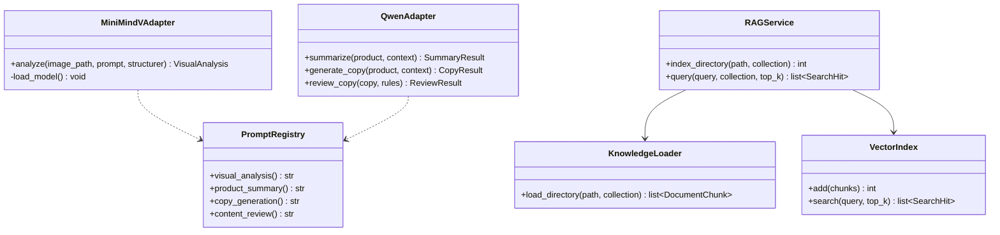
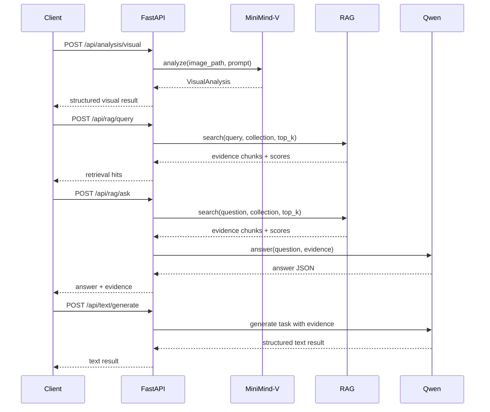

# Milestone 2 UML 与模块关系

## 类关系图

```mermaid
classDiagram
    class MiniMindVAdapter {
      +analyze(image_path, prompt, structurer) VisualAnalysis
      -load_model() void
    }
    class QwenAdapter {
      +summarize(product, context) SummaryResult
      +generate_copy(product, context) CopyResult
      +review_copy(copy, rules) ReviewResult
    }
    class PromptRegistry {
      +visual_analysis() str
      +product_summary() str
      +copy_generation() str
      +content_review() str
    }
    class KnowledgeLoader {
      +load_directory(path, collection) list~DocumentChunk~
    }
    class VectorIndex {
      +add(chunks) int
      +search(query, top_k) list~SearchHit~
    }
    class RAGService {
      +index_directory(path, collection) int
      +query(query, collection, top_k) list~SearchHit~
    }
    MiniMindVAdapter ..> PromptRegistry
    QwenAdapter ..> PromptRegistry
    RAGService --> KnowledgeLoader
    RAGService --> VectorIndex
```

## API 时序图

```mermaid
sequenceDiagram
    participant C as Client
    participant API as FastAPI
    participant V as MiniMind-V
    participant R as RAG
    participant Q as Qwen
    C->>API: POST /api/analysis/visual
    API->>V: analyze(image_path, prompt)
    V-->>API: VisualAnalysis
    API-->>C: structured visual result
    C->>API: POST /api/rag/query
    API->>R: search(query, collection, top_k)
    R-->>API: evidence chunks + scores
    API-->>C: retrieval hits
    C->>API: POST /api/rag/ask
    API->>R: search(question, collection, top_k)
    R-->>API: evidence chunks + scores
    API->>Q: answer(question, evidence)
    Q-->>API: answer JSON
    API-->>C: answer + evidence
    C->>API: POST /api/text/generate
    API->>Q: generate task with evidence
    Q-->>API: structured text result
    API-->>C: text result
```

