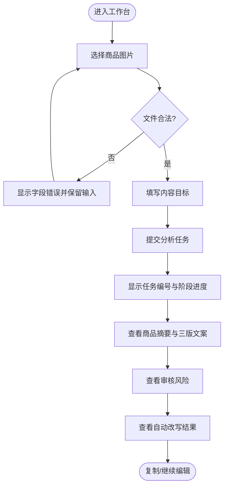
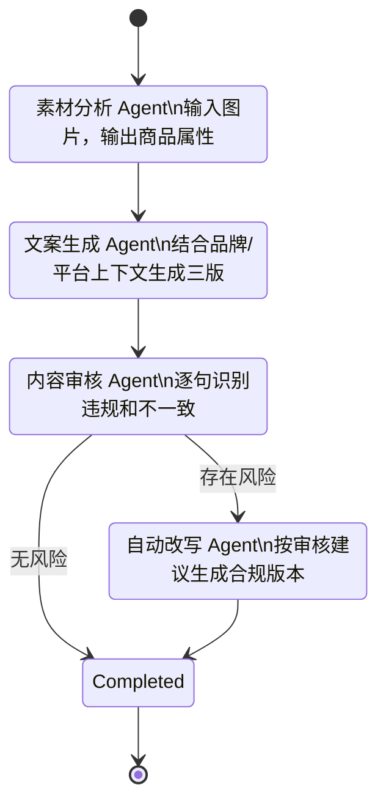

# 用户流程与 Agent 工作流

## 1. 用户流程

```mermaid
flowchart TD
    S([进入工作台]) --> F[选择商品图片]
    F --> V{文件合法?}
    V -- 否 --> E[显示字段错误并保留输入]
    E --> F
    V -- 是 --> I[填写内容目标]
    I --> T[提交分析任务]
    T --> P[显示任务编号与阶段进度]
    P --> R[查看商品摘要与三版文案]
    R --> C[查看审核风险]
    C --> W[查看自动改写结果]
    W --> D([复制/继续编辑])
```

## 2. Agent 工作流设计（本阶段为接口契约）

```mermaid
stateDiagram-v2
    [*] --> MaterialAnalysis
    MaterialAnalysis --> CopyGeneration
    CopyGeneration --> ContentReview
    ContentReview --> AutoRewrite: 存在风险
    ContentReview --> Completed: 无风险
    AutoRewrite --> Completed
    Completed --> [*]

    MaterialAnalysis: 素材分析 Agent\n输入图片，输出商品属性
    CopyGeneration: 文案生成 Agent\n结合品牌/平台上下文生成三版
    ContentReview: 内容审核 Agent\n逐句识别违规和不一致
    AutoRewrite: 自动改写 Agent\n按审核建议生成合规版本
```

## 3. 阶段事件契约

每个阶段都可以在后续替换为 Agent 事件：`stage`、`status`、`message`、`started_at`、`completed_at`。当前 API 直接返回任务快照，避免把前端绑定到具体模型供应商。

